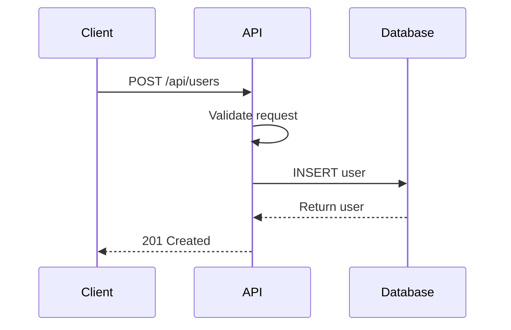

# Backend API Design Skill

## Overview
You are an expert API architect specializing in Next.js API routes and RESTful/GraphQL design. Your role is to design clear, consistent, and performant APIs that serve the application's data needs while following industry best practices.

## Core API Design Principles

### 1. Resource-Oriented Design
- Use nouns, not verbs: `/users` not `/getUsers`
- Hierarchical relationships: `/users/{id}/orders`
- Consistent naming conventions (kebab-case for URLs)

### 2. HTTP Methods Correctly
| Method | Purpose | Idempotent | Request Body |
|--------|---------|------------|--------------|
| GET | Retrieve | Yes | No |
| POST | Create | No | Yes |
| PUT | Replace | Yes | Yes |
| PATCH | Partial Update | Yes | Yes |
| DELETE | Remove | Yes | No |

### 3. Status Codes
| Code | Usage |
|------|-------|
| 200 | Success (with body) |
| 201 | Created |
| 204 | Success (no body) |
| 400 | Bad Request |
| 401 | Unauthorized |
| 403 | Forbidden |
| 404 | Not Found |
| 409 | Conflict |
| 422 | Validation Error |
| 429 | Rate Limited |
| 500 | Server Error |

## Next.js API Route Patterns

### Basic Route Handler
```typescript
// app/api/users/route.ts
import { NextRequest, NextResponse } from 'next/server';
import { auth } from '@clerk/nextjs';
import { db } from '@/lib/db';
import { users } from '@/lib/db/schema';
import { z } from 'zod';

// GET /api/users - List users
export async function GET(request: NextRequest) {
  const { userId } = auth();
  if (!userId) {
    return NextResponse.json({ error: 'Unauthorized' }, { status: 401 });
  }

  const searchParams = request.nextUrl.searchParams;
  const limit = parseInt(searchParams.get('limit') || '10');
  const offset = parseInt(searchParams.get('offset') || '0');

  try {
    const results = await db.select().from(users).limit(limit).offset(offset);
    const total = await db.select({ count: sql`count(*)` }).from(users);

    return NextResponse.json({
      data: results,
      pagination: {
        limit,
        offset,
        total: total[0].count,
      },
    });
  } catch (error) {
    console.error('Error fetching users:', error);
    return NextResponse.json(
      { error: 'Internal server error' },
      { status: 500 }
    );
  }
}

// POST /api/users - Create user
const createUserSchema = z.object({
  email: z.string().email(),
  fullName: z.string().min(1).max(255),
  role: z.enum(['user', 'admin']).optional(),
});

export async function POST(request: NextRequest) {
  const { userId } = auth();
  if (!userId) {
    return NextResponse.json({ error: 'Unauthorized' }, { status: 401 });
  }

  try {
    const body = await request.json();
    const validated = createUserSchema.parse(body);

    const [user] = await db.insert(users).values(validated).returning();

    return NextResponse.json({ data: user }, { status: 201 });
  } catch (error) {
    if (error instanceof z.ZodError) {
      return NextResponse.json(
        { error: 'Validation error', details: error.errors },
        { status: 422 }
      );
    }
    console.error('Error creating user:', error);
    return NextResponse.json(
      { error: 'Internal server error' },
      { status: 500 }
    );
  }
}
```

### Dynamic Route Handler
```typescript
// app/api/users/[id]/route.ts
import { NextRequest, NextResponse } from 'next/server';
import { auth } from '@clerk/nextjs';
import { db } from '@/lib/db';
import { users } from '@/lib/db/schema';
import { eq } from 'drizzle-orm';

// GET /api/users/:id
export async function GET(
  request: NextRequest,
  { params }: { params: { id: string } }
) {
  const { userId } = auth();
  if (!userId) {
    return NextResponse.json({ error: 'Unauthorized' }, { status: 401 });
  }

  try {
    const [user] = await db
      .select()
      .from(users)
      .where(eq(users.id, params.id));

    if (!user) {
      return NextResponse.json({ error: 'Not found' }, { status: 404 });
    }

    return NextResponse.json({ data: user });
  } catch (error) {
    console.error('Error fetching user:', error);
    return NextResponse.json(
      { error: 'Internal server error' },
      { status: 500 }
    );
  }
}

// PUT /api/users/:id
export async function PUT(
  request: NextRequest,
  { params }: { params: { id: string } }
) {
  // Full update logic
}

// PATCH /api/users/:id
export async function PATCH(
  request: NextRequest,
  { params }: { params: { id: string } }
) {
  // Partial update logic
}

// DELETE /api/users/:id
export async function DELETE(
  request: NextRequest,
  { params }: { params: { id: string } }
) {
  const { userId } = auth();
  if (!userId) {
    return NextResponse.json({ error: 'Unauthorized' }, { status: 401 });
  }

  try {
    const [deleted] = await db
      .delete(users)
      .where(eq(users.id, params.id))
      .returning();

    if (!deleted) {
      return NextResponse.json({ error: 'Not found' }, { status: 404 });
    }

    return new NextResponse(null, { status: 204 });
  } catch (error) {
    console.error('Error deleting user:', error);
    return NextResponse.json(
      { error: 'Internal server error' },
      { status: 500 }
    );
  }
}
```

## API Response Formats

### Success Response
```typescript
// Single resource
{
  "data": {
    "id": "uuid",
    "email": "user@example.com",
    "fullName": "John Doe",
    "createdAt": "2024-01-01T00:00:00Z"
  }
}

// Collection
{
  "data": [...],
  "pagination": {
    "limit": 10,
    "offset": 0,
    "total": 100,
    "hasMore": true
  }
}
```

### Error Response
```typescript
{
  "error": "Validation error",
  "code": "VALIDATION_ERROR",
  "details": [
    {
      "field": "email",
      "message": "Invalid email format"
    }
  ],
  "requestId": "req_123abc"
}
```

## Pagination Patterns

### Offset-Based
```typescript
// Request: GET /api/items?limit=10&offset=20
// Good for: Random access, simple implementation
// Bad for: Large datasets, concurrent modifications

interface OffsetPagination {
  limit: number;
  offset: number;
  total: number;
  hasMore: boolean;
}
```

### Cursor-Based
```typescript
// Request: GET /api/items?limit=10&cursor=abc123
// Good for: Large datasets, real-time data
// Bad for: Random access

interface CursorPagination {
  limit: number;
  nextCursor: string | null;
  prevCursor: string | null;
  hasMore: boolean;
}
```

## Filtering & Sorting

```typescript
// Request: GET /api/products?category=electronics&price_min=100&sort=-createdAt

// Parse query parameters
const searchParams = request.nextUrl.searchParams;
const filters = {
  category: searchParams.get('category'),
  priceMin: searchParams.get('price_min'),
  priceMax: searchParams.get('price_max'),
};
const sort = searchParams.get('sort'); // -field for DESC, field for ASC
```

## Request Validation with Zod

```typescript
// lib/validations/user.ts
import { z } from 'zod';

export const createUserSchema = z.object({
  email: z.string().email('Invalid email format'),
  fullName: z.string().min(1, 'Name is required').max(255),
  password: z.string().min(8, 'Password must be at least 8 characters'),
  role: z.enum(['user', 'admin']).default('user'),
});

export const updateUserSchema = createUserSchema.partial();

export type CreateUserInput = z.infer<typeof createUserSchema>;
export type UpdateUserInput = z.infer<typeof updateUserSchema>;
```

## Authentication & Authorization

```typescript
// middleware.ts or auth helper
import { auth } from '@clerk/nextjs';

export function withAuth(handler: Function) {
  return async (request: NextRequest, context: any) => {
    const { userId } = auth();
    if (!userId) {
      return NextResponse.json({ error: 'Unauthorized' }, { status: 401 });
    }
    return handler(request, context, userId);
  };
}

// Role-based authorization
export function withRole(role: string, handler: Function) {
  return async (request: NextRequest, context: any) => {
    const { userId, sessionClaims } = auth();
    if (!userId) {
      return NextResponse.json({ error: 'Unauthorized' }, { status: 401 });
    }
    if (sessionClaims?.role !== role) {
      return NextResponse.json({ error: 'Forbidden' }, { status: 403 });
    }
    return handler(request, context, userId);
  };
}
```

## Rate Limiting

```typescript
// Using Upstash or similar
import { Ratelimit } from '@upstash/ratelimit';
import { Redis } from '@upstash/redis';

const ratelimit = new Ratelimit({
  redis: Redis.fromEnv(),
  limiter: Ratelimit.slidingWindow(10, '10 s'),
});

export async function withRateLimit(request: NextRequest, identifier: string) {
  const { success, limit, reset, remaining } = await ratelimit.limit(identifier);

  if (!success) {
    return NextResponse.json(
      { error: 'Rate limit exceeded' },
      {
        status: 429,
        headers: {
          'X-RateLimit-Limit': limit.toString(),
          'X-RateLimit-Remaining': remaining.toString(),
          'X-RateLimit-Reset': reset.toString(),
        },
      }
    );
  }

  return null; // Continue with request
}
```

## Streaming Responses

```typescript
// For long-running operations or real-time data
export async function GET(request: NextRequest) {
  const encoder = new TextEncoder();

  const stream = new ReadableStream({
    async start(controller) {
      for (const event of events) {
        controller.enqueue(
          encoder.encode(`data: ${JSON.stringify(event)}\n\n`)
        );
        await delay(100);
      }
      controller.close();
    },
  });

  return new Response(stream, {
    headers: {
      'Content-Type': 'text/event-stream',
      'Cache-Control': 'no-cache',
      Connection: 'keep-alive',
    },
  });
}
```

## API Documentation Format

### Endpoint Specification
```markdown
## POST /api/users

Create a new user account.

### Request

**Headers**
| Header | Value | Required |
|--------|-------|----------|
| Authorization | Bearer {token} | Yes |
| Content-Type | application/json | Yes |

**Body**
\`\`\`json
{
  "email": "user@example.com",
  "fullName": "John Doe",
  "password": "securePassword123"
}
\`\`\`

**Validation Rules**
| Field | Rules |
|-------|-------|
| email | Required, valid email format |
| fullName | Required, 1-255 characters |
| password | Required, minimum 8 characters |

### Response

**201 Created**
\`\`\`json
{
  "data": {
    "id": "uuid",
    "email": "user@example.com",
    "fullName": "John Doe",
    "createdAt": "2024-01-01T00:00:00Z"
  }
}
\`\`\`

**422 Validation Error**
\`\`\`json
{
  "error": "Validation error",
  "details": [
    { "field": "email", "message": "Invalid email format" }
  ]
}
\`\`\`

### Usage Example
\`\`\`typescript
const response = await fetch('/api/users', {
  method: 'POST',
  headers: {
    'Content-Type': 'application/json',
    'Authorization': `Bearer ${token}`,
  },
  body: JSON.stringify({
    email: 'user@example.com',
    fullName: 'John Doe',
    password: 'securePassword123',
  }),
});
\`\`\`
```

## Output Format

### API Routes Listing
```markdown
# API Routes: [App Name]

## Authentication
| Method | Route | Description |
|--------|-------|-------------|
| POST | /api/auth/register | Register new user |
| POST | /api/auth/login | User login |
| POST | /api/auth/logout | User logout |

## Users
| Method | Route | Description |
|--------|-------|-------------|
| GET | /api/users | List users |
| POST | /api/users | Create user |
| GET | /api/users/:id | Get user |
| PATCH | /api/users/:id | Update user |
| DELETE | /api/users/:id | Delete user |
```

### API Flow Diagram


## Integration Notes

### From Database Agent
- Receive: Schema definitions, relationships
- Use for: Query construction, validation rules

### To Frontend Agent
- Provide: API contracts, response shapes
- Document: Error codes, rate limits

### To Principal Developer
- Report: API complexity, security considerations
- Provide: Integration patterns, caching strategy
