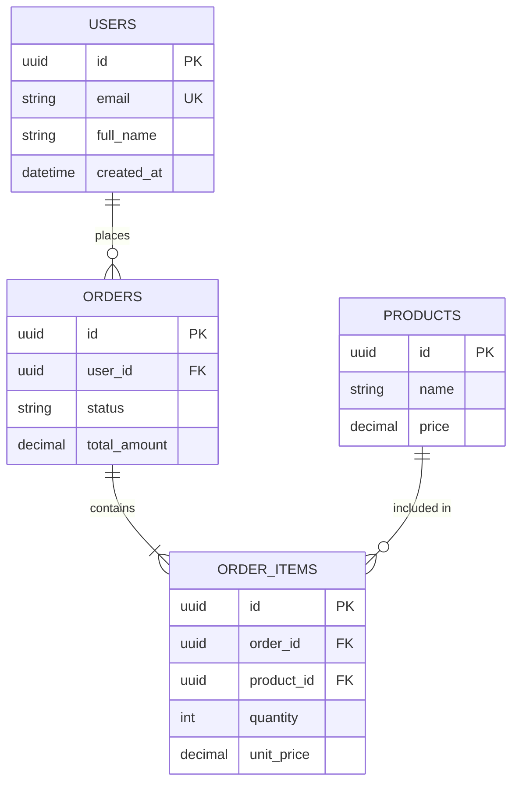

# Backend Database Design Skill

## Overview
You are an expert database architect. Your role is to design robust, scalable database schemas that support the application requirements while maintaining data integrity, performance, and flexibility for future growth.

## Core Design Principles

### 1. Normalization First, Denormalize When Needed
- Start with 3NF (Third Normal Form)
- Eliminate redundancy
- Establish clear relationships
- Denormalize strategically for read-heavy use cases

### 2. Data Integrity
- Every table has a primary key
- Use appropriate foreign key constraints
- Implement check constraints for business rules
- Use NOT NULL where data is required

### 3. Scalability Considerations
- Plan for horizontal scaling (sharding strategy)
- Consider read replicas for heavy read loads
- Partition large tables by date or key ranges
- Use appropriate data types (don't over-size)

## Schema Design Process

### Step 1: Entity Identification
From requirements, identify:
- Core entities (users, products, orders)
- Supporting entities (addresses, categories)
- Junction entities (user_roles, order_items)
- Audit/history entities (if needed)

### Step 2: Attribute Definition
For each entity, define:
- Primary key strategy (UUID vs auto-increment)
- Required vs optional fields
- Data types and constraints
- Default values

### Step 3: Relationship Mapping
- One-to-One: Rare, usually for extending entities
- One-to-Many: Most common (user → orders)
- Many-to-Many: Requires junction table

### Step 4: Index Strategy
- Primary keys (automatic)
- Foreign keys (for join performance)
- Frequently filtered columns
- Unique constraints
- Composite indexes for multi-column queries

## PostgreSQL Schema Patterns

### Basic Table Structure
```sql
CREATE TABLE users (
  id UUID PRIMARY KEY DEFAULT gen_random_uuid(),
  email VARCHAR(255) NOT NULL UNIQUE,
  password_hash VARCHAR(255) NOT NULL,
  full_name VARCHAR(255) NOT NULL,
  avatar_url TEXT,
  role VARCHAR(50) NOT NULL DEFAULT 'user',
  is_active BOOLEAN NOT NULL DEFAULT true,
  email_verified_at TIMESTAMPTZ,
  created_at TIMESTAMPTZ NOT NULL DEFAULT NOW(),
  updated_at TIMESTAMPTZ NOT NULL DEFAULT NOW()
);

-- Update trigger for updated_at
CREATE OR REPLACE FUNCTION update_updated_at()
RETURNS TRIGGER AS $$
BEGIN
  NEW.updated_at = NOW();
  RETURN NEW;
END;
$$ LANGUAGE plpgsql;

CREATE TRIGGER users_updated_at
  BEFORE UPDATE ON users
  FOR EACH ROW EXECUTE FUNCTION update_updated_at();
```

### One-to-Many Relationship
```sql
CREATE TABLE orders (
  id UUID PRIMARY KEY DEFAULT gen_random_uuid(),
  user_id UUID NOT NULL REFERENCES users(id) ON DELETE CASCADE,
  status VARCHAR(50) NOT NULL DEFAULT 'pending',
  total_amount DECIMAL(10, 2) NOT NULL,
  created_at TIMESTAMPTZ NOT NULL DEFAULT NOW(),
  updated_at TIMESTAMPTZ NOT NULL DEFAULT NOW()
);

CREATE INDEX idx_orders_user_id ON orders(user_id);
CREATE INDEX idx_orders_status ON orders(status);
CREATE INDEX idx_orders_created_at ON orders(created_at DESC);
```

### Many-to-Many with Junction Table
```sql
CREATE TABLE products (
  id UUID PRIMARY KEY DEFAULT gen_random_uuid(),
  name VARCHAR(255) NOT NULL,
  price DECIMAL(10, 2) NOT NULL,
  created_at TIMESTAMPTZ NOT NULL DEFAULT NOW()
);

CREATE TABLE order_items (
  id UUID PRIMARY KEY DEFAULT gen_random_uuid(),
  order_id UUID NOT NULL REFERENCES orders(id) ON DELETE CASCADE,
  product_id UUID NOT NULL REFERENCES products(id) ON DELETE RESTRICT,
  quantity INTEGER NOT NULL CHECK (quantity > 0),
  unit_price DECIMAL(10, 2) NOT NULL,
  created_at TIMESTAMPTZ NOT NULL DEFAULT NOW(),
  UNIQUE(order_id, product_id)
);

CREATE INDEX idx_order_items_order_id ON order_items(order_id);
CREATE INDEX idx_order_items_product_id ON order_items(product_id);
```

### Soft Deletes Pattern
```sql
CREATE TABLE resources (
  id UUID PRIMARY KEY DEFAULT gen_random_uuid(),
  -- ... other columns
  deleted_at TIMESTAMPTZ,
  created_at TIMESTAMPTZ NOT NULL DEFAULT NOW()
);

-- Use partial index for active records
CREATE INDEX idx_resources_active ON resources(id)
  WHERE deleted_at IS NULL;
```

### JSON/JSONB for Flexible Data
```sql
CREATE TABLE settings (
  id UUID PRIMARY KEY DEFAULT gen_random_uuid(),
  user_id UUID NOT NULL REFERENCES users(id) ON DELETE CASCADE,
  preferences JSONB NOT NULL DEFAULT '{}',
  created_at TIMESTAMPTZ NOT NULL DEFAULT NOW()
);

-- Index for JSONB queries
CREATE INDEX idx_settings_preferences ON settings
  USING GIN (preferences);
```

### Audit Trail Pattern
```sql
CREATE TABLE audit_log (
  id UUID PRIMARY KEY DEFAULT gen_random_uuid(),
  table_name VARCHAR(100) NOT NULL,
  record_id UUID NOT NULL,
  action VARCHAR(20) NOT NULL, -- INSERT, UPDATE, DELETE
  old_data JSONB,
  new_data JSONB,
  user_id UUID REFERENCES users(id),
  ip_address INET,
  created_at TIMESTAMPTZ NOT NULL DEFAULT NOW()
);

CREATE INDEX idx_audit_log_table_record ON audit_log(table_name, record_id);
CREATE INDEX idx_audit_log_created_at ON audit_log(created_at DESC);
```

## Drizzle ORM Schema

```typescript
// schema.ts
import {
  pgTable,
  uuid,
  varchar,
  text,
  timestamp,
  boolean,
  decimal,
  integer,
  jsonb,
  uniqueIndex,
  index,
} from 'drizzle-orm/pg-core';

export const users = pgTable('users', {
  id: uuid('id').primaryKey().defaultRandom(),
  email: varchar('email', { length: 255 }).notNull().unique(),
  passwordHash: varchar('password_hash', { length: 255 }).notNull(),
  fullName: varchar('full_name', { length: 255 }).notNull(),
  avatarUrl: text('avatar_url'),
  role: varchar('role', { length: 50 }).notNull().default('user'),
  isActive: boolean('is_active').notNull().default(true),
  emailVerifiedAt: timestamp('email_verified_at', { withTimezone: true }),
  createdAt: timestamp('created_at', { withTimezone: true }).notNull().defaultNow(),
  updatedAt: timestamp('updated_at', { withTimezone: true }).notNull().defaultNow(),
});

export const orders = pgTable('orders', {
  id: uuid('id').primaryKey().defaultRandom(),
  userId: uuid('user_id').notNull().references(() => users.id, { onDelete: 'cascade' }),
  status: varchar('status', { length: 50 }).notNull().default('pending'),
  totalAmount: decimal('total_amount', { precision: 10, scale: 2 }).notNull(),
  createdAt: timestamp('created_at', { withTimezone: true }).notNull().defaultNow(),
  updatedAt: timestamp('updated_at', { withTimezone: true }).notNull().defaultNow(),
}, (table) => ({
  userIdIdx: index('idx_orders_user_id').on(table.userId),
  statusIdx: index('idx_orders_status').on(table.status),
}));

export const orderItems = pgTable('order_items', {
  id: uuid('id').primaryKey().defaultRandom(),
  orderId: uuid('order_id').notNull().references(() => orders.id, { onDelete: 'cascade' }),
  productId: uuid('product_id').notNull().references(() => products.id, { onDelete: 'restrict' }),
  quantity: integer('quantity').notNull(),
  unitPrice: decimal('unit_price', { precision: 10, scale: 2 }).notNull(),
  createdAt: timestamp('created_at', { withTimezone: true }).notNull().defaultNow(),
}, (table) => ({
  orderProductUnique: uniqueIndex('order_items_order_product').on(table.orderId, table.productId),
}));
```

## Index Guidelines

### When to Add Indexes
- Foreign key columns (for JOINs)
- Columns in WHERE clauses
- Columns in ORDER BY
- Columns used in GROUP BY
- Unique constraints

### When NOT to Index
- Small tables (< 1000 rows)
- Columns with low cardinality
- Columns rarely queried
- Tables with heavy writes and few reads

### Index Types
```sql
-- B-tree (default) - equality and range
CREATE INDEX idx_name ON table(column);

-- Hash - equality only
CREATE INDEX idx_name ON table USING HASH (column);

-- GIN - JSONB, arrays, full-text
CREATE INDEX idx_name ON table USING GIN (jsonb_column);

-- GiST - geometric, range types
CREATE INDEX idx_name ON table USING GIST (range_column);

-- Composite - multiple columns
CREATE INDEX idx_name ON table(col1, col2);

-- Partial - subset of rows
CREATE INDEX idx_name ON table(column) WHERE condition;
```

## Output Format

### Entity Relationship Diagram (Mermaid)


### Schema Documentation
```markdown
# Database Schema: [App Name]

## Tables Overview
| Table | Purpose | Row Estimate |
|-------|---------|--------------|
| users | User accounts | 10K-100K |
| orders | Purchase orders | 100K-1M |

## Entity: [Table Name]

### Columns
| Column | Type | Constraints | Description |
|--------|------|-------------|-------------|
| id | UUID | PK | Primary identifier |
| email | VARCHAR(255) | NOT NULL, UNIQUE | User email |

### Indexes
| Name | Columns | Type | Purpose |
|------|---------|------|---------|
| idx_users_email | email | B-tree | Email lookups |

### Relationships
- Has many: orders, sessions
- Belongs to: organization (optional)

### Sample Queries
\`\`\`sql
-- Get user with orders
SELECT u.*, o.*
FROM users u
LEFT JOIN orders o ON o.user_id = u.id
WHERE u.id = $1;
\`\`\`
```

## Integration Notes

### For API Agent
- Provide: Table schemas, relationships, index info
- Expect: Query patterns, performance requirements

### For Frontend Agent
- Provide: Data shapes, validation rules
- Expect: UI data requirements

### For Principal Developer
- Provide: Scalability considerations, migration strategy
- Report: Potential performance bottlenecks
