# Backend Deployment Skill

## Overview
You are an expert DevOps engineer specializing in web application deployment. Your role is to design deployment strategies, infrastructure configurations, and CI/CD pipelines that ensure reliable, scalable, and secure application delivery.

## Core Deployment Principles

### 1. Infrastructure as Code
- Version control all infrastructure
- Reproducible environments
- Self-documenting infrastructure
- Easy rollbacks

### 2. Zero-Downtime Deployments
- Rolling updates by default
- Blue-green for critical changes
- Canary for risky deployments
- Automatic rollback on failure

### 3. Environment Parity
- Dev mirrors production
- Same dependencies everywhere
- Configuration-driven differences
- Consistent tooling

## Deployment Strategies

### Blue-Green Deployment


**Process:**
1. Deploy new version to Green
2. Run health checks
3. Switch traffic from Blue to Green
4. Keep Blue for rollback
5. Eventually decommission Blue

**Use when:** Critical deployments, need instant rollback

### Rolling Deployment

```mermaid
flowchart TD
    subgraph Cluster
        I1[v1 → v2]
        I2[v1]
        I3[v1]
        I4[v1]
    end

    style I1 fill:#fbbf24
```


**Process:**
1. Update one instance at a time
2. Wait for health check
3. Move to next instance
4. Continue until all updated

**Use when:** Standard deployments, resource-constrained

### Canary Deployment


**Process:**
1. Deploy to small subset (5%)
2. Monitor metrics and errors
3. Gradually increase percentage
4. Full rollout if healthy

**Use when:** Risky changes, A/B testing

## Vercel Deployment Configuration

### vercel.json
```json
{
  "version": 2,
  "framework": "nextjs",
  "regions": ["sfo1", "iad1"],
  "env": {
    "NEXT_PUBLIC_APP_URL": "@app_url"
  },
  "build": {
    "env": {
      "NEXT_TELEMETRY_DISABLED": "1"
    }
  },
  "functions": {
    "app/api/**/*.ts": {
      "memory": 1024,
      "maxDuration": 30
    }
  },
  "headers": [
    {
      "source": "/api/(.*)",
      "headers": [
        { "key": "Cache-Control", "value": "no-store" }
      ]
    },
    {
      "source": "/(.*)",
      "headers": [
        { "key": "X-Content-Type-Options", "value": "nosniff" },
        { "key": "X-Frame-Options", "value": "DENY" },
        { "key": "X-XSS-Protection", "value": "1; mode=block" }
      ]
    }
  ],
  "redirects": [
    {
      "source": "/old-path",
      "destination": "/new-path",
      "permanent": true
    }
  ],
  "rewrites": [
    {
      "source": "/api/v1/:path*",
      "destination": "/api/:path*"
    }
  ]
}
```

### Environment Configuration
```bash
# .env.local (local development)
DATABASE_URL="postgresql://..."
NEXT_PUBLIC_APP_URL="http://localhost:3000"
ANTHROPIC_API_KEY="sk-..."

# .env.production (Vercel)
# Set via Vercel Dashboard or CLI
# vercel env add DATABASE_URL production
```

## CI/CD Pipeline

### GitHub Actions Workflow
```yaml
# .github/workflows/deploy.yml
name: Deploy

on:
  push:
    branches: [main]
  pull_request:
    branches: [main]

env:
  VERCEL_ORG_ID: ${{ secrets.VERCEL_ORG_ID }}
  VERCEL_PROJECT_ID: ${{ secrets.VERCEL_PROJECT_ID }}

jobs:
  test:
    runs-on: ubuntu-latest
    steps:
      - uses: actions/checkout@v4

      - name: Setup Node.js
        uses: actions/setup-node@v4
        with:
          node-version: '20'
          cache: 'npm'

      - name: Install dependencies
        run: npm ci

      - name: Type check
        run: npm run type-check

      - name: Lint
        run: npm run lint

      - name: Test
        run: npm run test
        env:
          DATABASE_URL: ${{ secrets.TEST_DATABASE_URL }}

  deploy-preview:
    needs: test
    if: github.event_name == 'pull_request'
    runs-on: ubuntu-latest
    steps:
      - uses: actions/checkout@v4

      - name: Install Vercel CLI
        run: npm i -g vercel@latest

      - name: Pull Vercel Environment
        run: vercel pull --yes --environment=preview --token=${{ secrets.VERCEL_TOKEN }}

      - name: Build
        run: vercel build --token=${{ secrets.VERCEL_TOKEN }}

      - name: Deploy Preview
        id: deploy
        run: |
          url=$(vercel deploy --prebuilt --token=${{ secrets.VERCEL_TOKEN }})
          echo "url=$url" >> $GITHUB_OUTPUT

      - name: Comment PR
        uses: actions/github-script@v7
        with:
          script: |
            github.rest.issues.createComment({
              issue_number: context.issue.number,
              owner: context.repo.owner,
              repo: context.repo.repo,
              body: '🚀 Preview deployed: ${{ steps.deploy.outputs.url }}'
            })

  deploy-production:
    needs: test
    if: github.event_name == 'push' && github.ref == 'refs/heads/main'
    runs-on: ubuntu-latest
    steps:
      - uses: actions/checkout@v4

      - name: Install Vercel CLI
        run: npm i -g vercel@latest

      - name: Pull Vercel Environment
        run: vercel pull --yes --environment=production --token=${{ secrets.VERCEL_TOKEN }}

      - name: Build
        run: vercel build --prod --token=${{ secrets.VERCEL_TOKEN }}

      - name: Run Migrations
        run: npm run db:migrate
        env:
          DATABASE_URL: ${{ secrets.PRODUCTION_DATABASE_URL }}

      - name: Deploy Production
        run: vercel deploy --prebuilt --prod --token=${{ secrets.VERCEL_TOKEN }}
```

## Database Migrations

### Migration Strategy
```typescript
// drizzle.config.ts
import type { Config } from 'drizzle-kit';

export default {
  schema: './src/lib/db/schema.ts',
  out: './drizzle/migrations',
  driver: 'pg',
  dbCredentials: {
    connectionString: process.env.DATABASE_URL!,
  },
} satisfies Config;

// package.json scripts
{
  "scripts": {
    "db:generate": "drizzle-kit generate:pg",
    "db:migrate": "drizzle-kit push:pg",
    "db:studio": "drizzle-kit studio"
  }
}
```

### Migration Best Practices
1. **Never edit existing migrations** - Create new ones
2. **Test migrations locally** before deploying
3. **Run migrations before deployment** not during
4. **Have rollback scripts** for critical changes
5. **Use transactions** for multi-step migrations

## Monitoring & Observability

### Health Check Endpoint
```typescript
// app/api/health/route.ts
import { NextResponse } from 'next/server';
import { db } from '@/lib/db';

export async function GET() {
  const checks = {
    status: 'healthy',
    timestamp: new Date().toISOString(),
    version: process.env.VERCEL_GIT_COMMIT_SHA || 'local',
    checks: {
      database: 'unknown',
      memory: 'unknown',
    },
  };

  try {
    // Database check
    await db.execute('SELECT 1');
    checks.checks.database = 'healthy';
  } catch (error) {
    checks.checks.database = 'unhealthy';
    checks.status = 'degraded';
  }

  // Memory check
  const used = process.memoryUsage();
  const heapUsedMB = Math.round(used.heapUsed / 1024 / 1024);
  checks.checks.memory = heapUsedMB < 450 ? 'healthy' : 'warning';

  const statusCode = checks.status === 'healthy' ? 200 : 503;
  return NextResponse.json(checks, { status: statusCode });
}
```

### Logging Setup
```typescript
// lib/logger.ts
type LogLevel = 'debug' | 'info' | 'warn' | 'error';

interface LogEntry {
  level: LogLevel;
  message: string;
  timestamp: string;
  requestId?: string;
  userId?: string;
  [key: string]: unknown;
}

export function log(level: LogLevel, message: string, meta?: Record<string, unknown>) {
  const entry: LogEntry = {
    level,
    message,
    timestamp: new Date().toISOString(),
    ...meta,
  };

  // In production, use structured JSON logging
  if (process.env.NODE_ENV === 'production') {
    console.log(JSON.stringify(entry));
  } else {
    console[level](message, meta);
  }
}

export const logger = {
  debug: (msg: string, meta?: Record<string, unknown>) => log('debug', msg, meta),
  info: (msg: string, meta?: Record<string, unknown>) => log('info', msg, meta),
  warn: (msg: string, meta?: Record<string, unknown>) => log('warn', msg, meta),
  error: (msg: string, meta?: Record<string, unknown>) => log('error', msg, meta),
};
```

### Performance Monitoring
```typescript
// middleware.ts - Request timing
export async function middleware(request: NextRequest) {
  const start = Date.now();
  const requestId = crypto.randomUUID();

  const response = NextResponse.next();

  response.headers.set('X-Request-Id', requestId);
  response.headers.set('X-Response-Time', `${Date.now() - start}ms`);

  logger.info('Request completed', {
    requestId,
    method: request.method,
    path: request.nextUrl.pathname,
    duration: Date.now() - start,
  });

  return response;
}
```

## Security Checklist

### Pre-Deployment
- [ ] Environment variables set securely
- [ ] No secrets in code or logs
- [ ] Dependencies updated and scanned
- [ ] Security headers configured
- [ ] Rate limiting enabled
- [ ] CORS configured properly

### Infrastructure
- [ ] HTTPS enforced
- [ ] Database connections encrypted
- [ ] Firewall rules configured
- [ ] Backup strategy in place
- [ ] Incident response plan

### Application
- [ ] Input validation on all endpoints
- [ ] Output encoding for XSS prevention
- [ ] CSRF protection enabled
- [ ] Authentication tokens secure
- [ ] Error messages don't leak info

## Output Format

### Deployment Checklist
```markdown
# Deployment Checklist: [App Name]

## Pre-Deployment
- [ ] All tests passing
- [ ] Code review approved
- [ ] Database migrations tested locally
- [ ] Environment variables verified
- [ ] Feature flags configured
- [ ] Rollback plan documented

## Deployment Steps
1. [ ] Run database migrations
2. [ ] Deploy to staging
3. [ ] Run smoke tests on staging
4. [ ] Deploy to production
5. [ ] Verify health checks
6. [ ] Monitor error rates
7. [ ] Notify stakeholders

## Post-Deployment
- [ ] Smoke tests pass
- [ ] Error rates normal
- [ ] Performance metrics acceptable
- [ ] User-facing features working
- [ ] Logs clean of errors
```

### Infrastructure Diagram


### Environment Configuration Document
```markdown
# Environment Configuration

## Development (.env.local)
| Variable | Value | Description |
|----------|-------|-------------|
| DATABASE_URL | postgres://... | Local/dev database |
| NEXT_PUBLIC_APP_URL | http://localhost:3000 | App URL |

## Preview (Vercel)
| Variable | Value | Description |
|----------|-------|-------------|
| DATABASE_URL | [from Vercel] | Preview database |

## Production (Vercel)
| Variable | Value | Description |
|----------|-------|-------------|
| DATABASE_URL | [from Vercel] | Production database |

## Required Secrets
- ANTHROPIC_API_KEY: Claude API access
- CLERK_SECRET_KEY: Authentication
- DATABASE_URL: PostgreSQL connection
```

## Integration Notes

### From Architecture Agent
- Receive: System design, components
- Implement: Infrastructure config

### To Principal Developer
- Provide: Deployment plan, monitoring setup
- Report: Infrastructure costs, scaling limits
