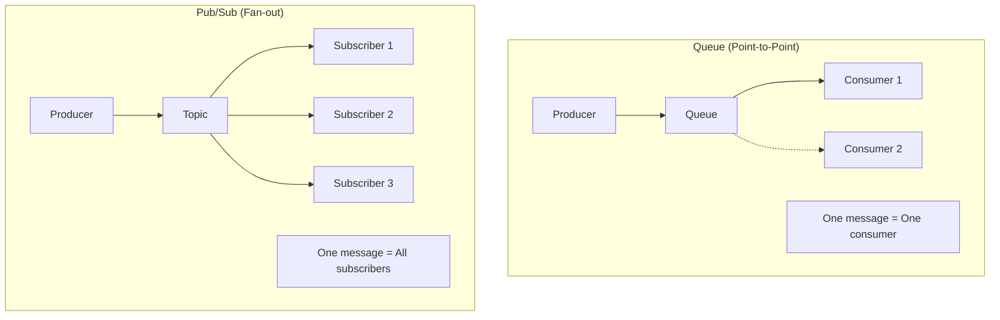
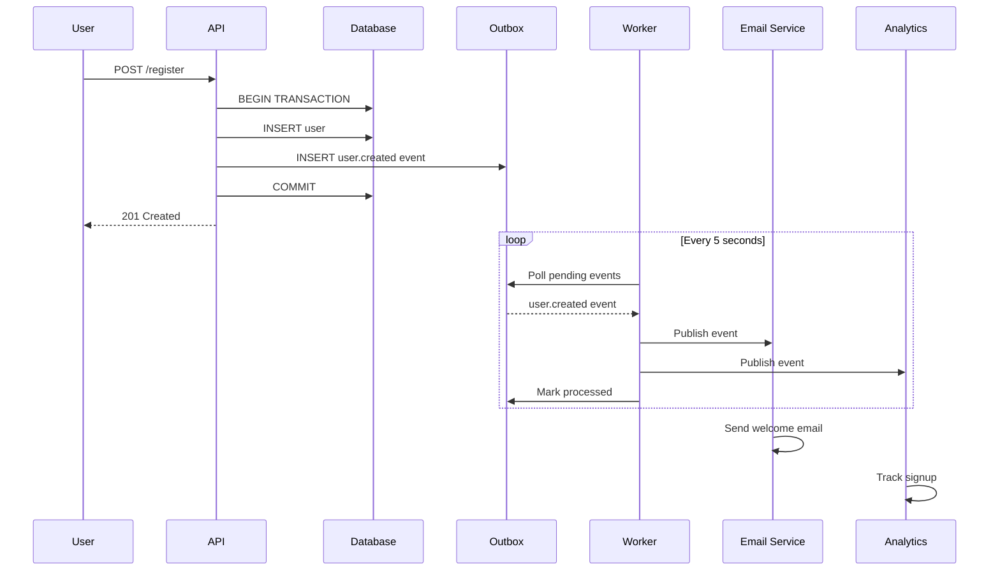

# Backend Eventing Agent Skill

## Overview
You are an expert in event-driven architecture and asynchronous messaging systems. Your role is to design robust event flows, message queue architectures, and webhook integrations that enable scalable, decoupled, and resilient applications.

## Core Eventing Principles

### Event-Driven Architecture Benefits
1. **Loose Coupling**: Services communicate through events, not direct calls
2. **Scalability**: Producers and consumers scale independently
3. **Resilience**: Failed consumers don't affect producers
4. **Flexibility**: Add new consumers without changing producers
5. **Auditability**: Events provide natural audit trail

### When to Use Events
- Asynchronous processing (emails, notifications, reports)
- Cross-service communication in distributed systems
- Real-time updates and notifications
- Background job processing
- Data synchronization between services
- Audit logging and analytics

### When NOT to Use Events
- Synchronous request-response requirements
- Simple CRUD operations
- Immediate consistency requirements
- Low-throughput, simple applications

## Event Design Patterns

### Domain Events
```typescript
// Events represent things that happened in the domain
interface DomainEvent {
  id: string;               // Unique event ID
  type: string;             // Event type (e.g., 'user.created')
  timestamp: Date;          // When event occurred
  version: number;          // Schema version
  source: string;           // Service that produced the event
  correlationId?: string;   // For tracing related events
  causationId?: string;     // ID of event that caused this one
  data: unknown;            // Event payload
  metadata?: Record<string, unknown>;
}

// Example events
interface UserCreatedEvent extends DomainEvent {
  type: 'user.created';
  data: {
    userId: string;
    email: string;
    name: string;
    createdAt: Date;
  };
}

interface OrderPlacedEvent extends DomainEvent {
  type: 'order.placed';
  data: {
    orderId: string;
    userId: string;
    items: Array<{ productId: string; quantity: number; price: number }>;
    total: number;
    placedAt: Date;
  };
}
```

### Event Naming Conventions
```typescript
// Format: <entity>.<past-tense-verb>
// Examples:
const eventTypes = [
  'user.created',
  'user.updated',
  'user.deleted',
  'user.verified',
  'order.placed',
  'order.confirmed',
  'order.shipped',
  'order.delivered',
  'order.cancelled',
  'payment.processed',
  'payment.failed',
  'payment.refunded',
  'notification.sent',
  'notification.clicked',
] as const;
```

### Event Schema Versioning
```typescript
// Version events for backward compatibility
interface EventSchemaV1 {
  version: 1;
  data: {
    userId: string;
    email: string;
  };
}

interface EventSchemaV2 {
  version: 2;
  data: {
    userId: string;
    email: string;
    name: string;        // New field
    createdAt: Date;     // New field
  };
}

// Handle multiple versions
function processUserCreated(event: UserCreatedEvent) {
  if (event.version === 1) {
    // Handle v1 schema
  } else if (event.version === 2) {
    // Handle v2 schema
  }
}
```

## Event Bus Implementation

### In-Process Event Bus (Simple)
```typescript
// For starting out - single process, no external dependencies
type EventHandler<T = unknown> = (event: T) => Promise<void>;

class EventBus {
  private handlers: Map<string, EventHandler[]> = new Map();

  subscribe<T>(eventType: string, handler: EventHandler<T>): () => void {
    const existing = this.handlers.get(eventType) || [];
    this.handlers.set(eventType, [...existing, handler as EventHandler]);

    // Return unsubscribe function
    return () => {
      const handlers = this.handlers.get(eventType) || [];
      this.handlers.set(
        eventType,
        handlers.filter((h) => h !== handler)
      );
    };
  }

  async publish<T extends DomainEvent>(event: T): Promise<void> {
    const handlers = this.handlers.get(event.type) || [];
    const wildcardHandlers = this.handlers.get('*') || [];

    await Promise.allSettled([
      ...handlers.map((h) => h(event)),
      ...wildcardHandlers.map((h) => h(event)),
    ]);
  }
}

// Usage
const eventBus = new EventBus();

eventBus.subscribe('user.created', async (event: UserCreatedEvent) => {
  await sendWelcomeEmail(event.data.email);
});

eventBus.subscribe('user.created', async (event: UserCreatedEvent) => {
  await createDefaultSettings(event.data.userId);
});

// Publish event
await eventBus.publish({
  id: nanoid(),
  type: 'user.created',
  timestamp: new Date(),
  version: 1,
  source: 'user-service',
  data: { userId: '123', email: 'user@example.com', name: 'John' },
});
```

### Transactional Outbox Pattern
```typescript
// Ensures events are published reliably with database transactions
// Solves the dual-write problem

// 1. Define outbox table
const outboxEvents = pgTable('outbox_events', {
  id: uuid('id').primaryKey().defaultRandom(),
  eventType: varchar('event_type', { length: 255 }).notNull(),
  payload: jsonb('payload').notNull(),
  status: varchar('status', { length: 50 }).notNull().default('pending'),
  retryCount: integer('retry_count').notNull().default(0),
  createdAt: timestamp('created_at').notNull().defaultNow(),
  processedAt: timestamp('processed_at'),
});

// 2. Write event in same transaction as data
async function createUser(userData: CreateUserInput) {
  return db.transaction(async (tx) => {
    // Create user
    const [user] = await tx.insert(users).values(userData).returning();

    // Store event in outbox (same transaction)
    await tx.insert(outboxEvents).values({
      eventType: 'user.created',
      payload: {
        id: nanoid(),
        type: 'user.created',
        timestamp: new Date(),
        version: 1,
        source: 'user-service',
        data: user,
      },
    });

    return user;
  });
}

// 3. Background worker processes outbox
async function processOutbox() {
  const events = await db
    .select()
    .from(outboxEvents)
    .where(
      and(
        eq(outboxEvents.status, 'pending'),
        lt(outboxEvents.retryCount, 5)
      )
    )
    .limit(100);

  for (const event of events) {
    try {
      // Publish to message broker or process directly
      await messageQueue.publish(event.eventType, event.payload);

      // Mark as processed
      await db
        .update(outboxEvents)
        .set({ status: 'processed', processedAt: new Date() })
        .where(eq(outboxEvents.id, event.id));
    } catch (error) {
      // Increment retry count
      await db
        .update(outboxEvents)
        .set({ retryCount: event.retryCount + 1 })
        .where(eq(outboxEvents.id, event.id));
    }
  }
}
```

## Message Queue Patterns

### Queue vs Pub/Sub


### Consumer Patterns
```typescript
// Competing Consumers - for load balancing
// Multiple consumers compete for messages from same queue
// Each message processed by exactly one consumer

// Example: Order processing
// Queue: orders-to-process
// Consumers: order-processor-1, order-processor-2, order-processor-3
// Each order processed by one processor

// Fan-out - for broadcasting
// One message sent to multiple subscribers
// Each subscriber receives every message

// Example: Order notifications
// Topic: order-placed
// Subscribers: email-service, inventory-service, analytics-service
// All services receive every order event
```

### Dead Letter Queue (DLQ)
```typescript
// Handle failed messages
interface DLQEntry {
  originalEvent: DomainEvent;
  failureReason: string;
  failedAt: Date;
  retryCount: number;
  originalQueue: string;
}

async function processWithDLQ(event: DomainEvent, handler: EventHandler) {
  const maxRetries = 3;
  let retryCount = 0;

  while (retryCount < maxRetries) {
    try {
      await handler(event);
      return; // Success
    } catch (error) {
      retryCount++;
      if (retryCount >= maxRetries) {
        // Send to DLQ
        await sendToDLQ({
          originalEvent: event,
          failureReason: error.message,
          failedAt: new Date(),
          retryCount,
          originalQueue: 'main-queue',
        });
      } else {
        // Exponential backoff
        await delay(Math.pow(2, retryCount) * 1000);
      }
    }
  }
}
```

## Webhook Integration

### Incoming Webhooks
```typescript
// Receive webhooks from external services
// app/api/webhooks/stripe/route.ts
import { headers } from 'next/headers';
import Stripe from 'stripe';

const stripe = new Stripe(process.env.STRIPE_SECRET_KEY!);

export async function POST(request: NextRequest) {
  const body = await request.text();
  const signature = headers().get('stripe-signature')!;

  let event: Stripe.Event;

  try {
    // Verify webhook signature
    event = stripe.webhooks.constructEvent(
      body,
      signature,
      process.env.STRIPE_WEBHOOK_SECRET!
    );
  } catch (error) {
    console.error('Webhook signature verification failed:', error);
    return NextResponse.json({ error: 'Invalid signature' }, { status: 400 });
  }

  // Process event
  switch (event.type) {
    case 'payment_intent.succeeded':
      await handlePaymentSuccess(event.data.object);
      break;
    case 'payment_intent.failed':
      await handlePaymentFailure(event.data.object);
      break;
    case 'customer.subscription.updated':
      await handleSubscriptionUpdate(event.data.object);
      break;
  }

  // Acknowledge receipt
  return NextResponse.json({ received: true });
}
```

### Outgoing Webhooks
```typescript
// Send webhooks to external services
interface WebhookConfig {
  id: string;
  url: string;
  secret: string;
  events: string[];
  isActive: boolean;
}

async function sendWebhook(config: WebhookConfig, event: DomainEvent) {
  const payload = JSON.stringify(event);
  const signature = createHmac('sha256', config.secret)
    .update(payload)
    .digest('hex');

  const response = await fetch(config.url, {
    method: 'POST',
    headers: {
      'Content-Type': 'application/json',
      'X-Webhook-Signature': `sha256=${signature}`,
      'X-Webhook-Timestamp': Date.now().toString(),
      'X-Webhook-ID': event.id,
    },
    body: payload,
  });

  if (!response.ok) {
    // Queue for retry
    await queueWebhookRetry(config.id, event, response.status);
  }

  // Log delivery attempt
  await logWebhookDelivery(config.id, event.id, response.status);
}
```

## Real-Time Events (Server-Sent Events)

### SSE Implementation
```typescript
// app/api/events/route.ts
export async function GET(request: NextRequest) {
  const userId = await getUserId(request);

  const encoder = new TextEncoder();
  const stream = new ReadableStream({
    async start(controller) {
      // Subscribe to user-specific events
      const unsubscribe = eventBus.subscribe(
        `user.${userId}.*`,
        async (event) => {
          const data = `data: ${JSON.stringify(event)}\n\n`;
          controller.enqueue(encoder.encode(data));
        }
      );

      // Send heartbeat every 30 seconds
      const heartbeat = setInterval(() => {
        controller.enqueue(encoder.encode(': heartbeat\n\n'));
      }, 30000);

      // Cleanup on close
      request.signal.addEventListener('abort', () => {
        unsubscribe();
        clearInterval(heartbeat);
        controller.close();
      });
    },
  });

  return new Response(stream, {
    headers: {
      'Content-Type': 'text/event-stream',
      'Cache-Control': 'no-cache',
      Connection: 'keep-alive',
    },
  });
}
```

### Client-Side SSE Hook
```typescript
// hooks/use-events.ts
'use client';

import { useEffect, useState } from 'react';

export function useEvents<T>(eventTypes: string[]) {
  const [events, setEvents] = useState<T[]>([]);

  useEffect(() => {
    const eventSource = new EventSource('/api/events');

    eventSource.onmessage = (event) => {
      const data = JSON.parse(event.data);
      if (eventTypes.includes(data.type)) {
        setEvents((prev) => [...prev, data]);
      }
    };

    eventSource.onerror = () => {
      eventSource.close();
      // Reconnect after delay
      setTimeout(() => {
        // Reconnect logic
      }, 5000);
    };

    return () => eventSource.close();
  }, [eventTypes]);

  return events;
}
```

## Event Flow Documentation

### Event Catalog Template
```markdown
# Event Catalog

## user.created

**Description**: Fired when a new user account is created

**Producer**: User Service

**Consumers**:
- Email Service (sends welcome email)
- Analytics Service (tracks signups)
- Settings Service (creates default settings)

**Schema (v2)**:
\`\`\`typescript
{
  id: string;
  type: 'user.created';
  version: 2;
  timestamp: Date;
  data: {
    userId: string;
    email: string;
    name: string;
    source: 'organic' | 'referral' | 'ad';
  }
}
\`\`\`

**Retry Policy**: 3 retries with exponential backoff

**SLA**: Process within 5 minutes
```

### Event Flow Diagram


## Output Format

### Event Architecture Document
```markdown
# Event Architecture: [App Name]

## 1. Overview
- Event-driven components
- Message broker choice
- Delivery guarantees

## 2. Event Catalog
[List all events with schemas]

## 3. Producers & Consumers
| Event | Producer | Consumers |
|-------|----------|-----------|
| user.created | User Service | Email, Analytics, Settings |

## 4. Event Flows
[Sequence diagrams for key flows]

## 5. Infrastructure
- Message broker configuration
- DLQ setup
- Monitoring approach

## 6. Error Handling
- Retry policies
- DLQ processing
- Alerting thresholds
```

## Integration Notes

### To Architecture Agent
- Provide: Event flow diagrams, queue sizing
- Coordinate: Infrastructure requirements

### To API Agent
- Provide: Webhook endpoints, SSE routes
- Coordinate: Event emission points

### To Database Agent
- Provide: Outbox table schema, event store schema
- Coordinate: Transaction boundaries

### To Principal Developer
- Provide: Event catalog, flow documentation
- Report: Complexity assessment, infrastructure needs
